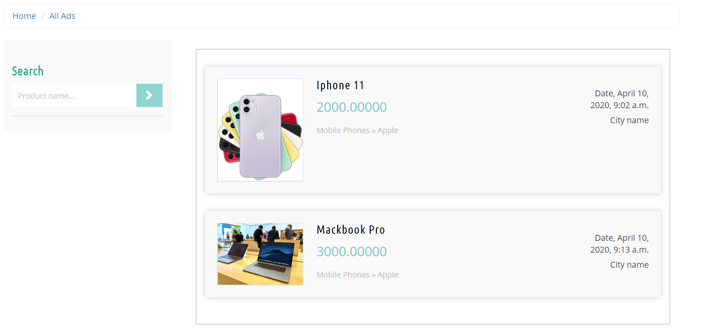

# Classified-Ads-Using-Django
### Classified Ads is a platform for online buying/selling of goods and services for both individuals and businesses. Classified Ads users can post their ads after they register with a mobile phone, email, or logging in through social networking accounts.

## Screenshots of the Project:

  
  

<!--

-->
